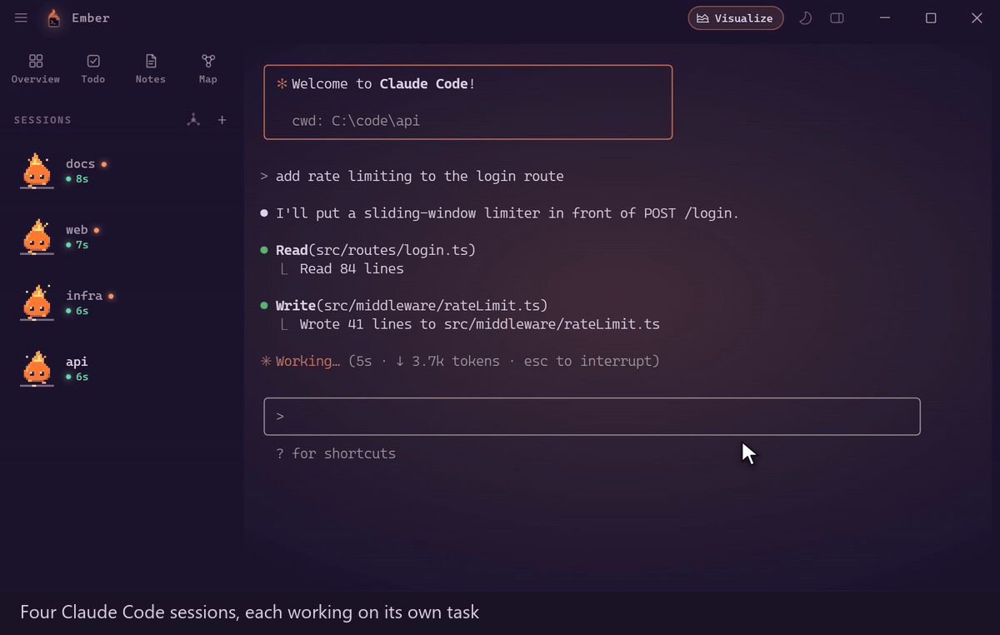

<p align="center"></p>

<h1 align="center">Ember</h1>

<p align="center">A Windows terminal for running your coding agents side by side. Bring your CLI, no API keys.</p>



**Download:** [ember.deepanswerlabs.com](https://ember.deepanswerlabs.com), or
`Ember-Setup-win-x64.exe` from the [releases page](https://github.com/afetiu/ember-terminal/releases/latest).
The clip above is also an [MP4](docs/media/ember-demo.mp4).

- **Sidebar cards that know which agent needs you.** Every session is a card that reads
  its state off the terminal: working, stopped on a question for you, or done and handing
  back. Look at a session only when its card asks.
- **An orchestrator.** One agent that sees every session, hands them work, opens new ones
  and tells you when each is done.
- **A panel beside each terminal.** The agent draws diagrams, tables and pages on it, and
  the panel's buttons type back into the session.
- **Notes and a todo list** in the same window, kept as plain Markdown files that your
  agents can read and write from the shell.
- **A map** of a project's architecture that the agent keeps up to date as the code
  changes.
- **Your CLI, your login.** Claude Code, Codex CLI, Gemini CLI, Cursor Agent, OpenCode and
  Copilot CLI run as they are, on the plan you already pay for.

Free · MIT · no account · no telemetry · Windows 10/11 x64

**Not code signed yet.** Windows SmartScreen will warn the first time you run the
installer: choose "More info", then "Run anyway". Every release is built from this
repository by GitHub Actions and ships with `SHA256SUMS.txt` so you can check the file
(see [CODE_SIGNING.md](CODE_SIGNING.md)). It installs for your user only and never asks
for admin rights.

## Agents

Ember hosts the agent CLIs you already use — **Claude Code, Codex CLI, Gemini CLI, Cursor
Agent, OpenCode and Copilot CLI** — and **never asks for an LLM API key**. Every AI feature
(the map, check-todos, the panel) runs through the CLI you pick in Settings › Agent, signed
in with your own plan. The first launch walks through picking one, with Install buttons for
the ones that are missing. The orchestrator — the agent that sees every session and hands
them work — is a headless turn of that same CLI with a small MCP server attached
(`resources/mcp-orch.mjs`), whose tools reach the tabs through Ember's local bridge.  Ember
stores no credentials of any kind; Settings › Labs holds only the experimental phone link.

| CLI | Panel (MCP) | Status on the card | Map / headless |
| --- | --- | --- | --- |
| Claude Code | `--mcp-config` | title + screen | `-p --output-format stream-json` |
| Codex CLI | `-c mcp_servers.…` + `env_vars` | shim title + screen | `exec --json --sandbox read-only` |
| Gemini CLI | not yet — Gemini only reads extra settings from admin-owned folders | shim title + screen | stdin, `--skip-trust`, text |
| Cursor Agent | add it yourself in `~/.cursor/mcp.json` | shim title + screen | `-p --output-format stream-json --mode ask` |
| OpenCode | `OPENCODE_CONFIG` | shim title + screen | `run --agent plan`, stdin, text |
| Copilot CLI | `--additional-mcp-config @file` | shim title + screen | `-s … -p`, text |

The table lives in `src/shared/agents.ts`; `src/main/agents.ts` detects, runs and parses.
Claude Code, Codex, Copilot CLI (1.0.91) and OpenCode (1.18.34) are verified end to end:
headless answer, read-only map and orchestrator tool calls. Gemini CLI (0.62) is verified up
to the model call, and its orchestrator gets the MCP server through a workspace of its own; a
signed-in run has not been done here yet.

## The shell

PowerShell underneath, completely untouched. Windows Terminal can't animate its
chrome — the only motion setting in its entire config schema is `disableAnimations: true|false`, and there is no cursor easing at
all. Ember replaces the *window*, not the shell: `pwsh.exe` is spawned through the
same bundled ConPTY that Windows Terminal itself ships, so your profile, oh-my-posh,
modules and PSReadLine behave exactly as before.

## Code signing policy

Releases are not code signed yet. They are built from this repository by GitHub Actions
and ship with `SHA256SUMS.txt` — see [CODE_SIGNING.md](CODE_SIGNING.md) for how to check a
download, the team roles and the privacy policy.

## What's actually different

- **A caret that travels.** Two springs — a stiff head and a slack tail — with the
  smear drawn as the convex hull between them. It stretches with speed and collapses
  to nothing when it settles. Measured peak trail: 333px wide on a long line jump.
- **Sessions live in a left sidebar as cards**, not a tab strip — because each one
  carries real state that doesn't fit in a 200px tab.
- **Every card knows what it's doing** — derived live from the terminal, and said
  without words: the sprite is the status.
- **Agent sessions get Cinder**, a small ember spirit whose flame burns high while the
  agent works, dims to a dozing coal while it waits, flares with a raised hand when it's
  blocked on you, and waves when it just has an answer for you.
- **Switching is a real transition** — directional slide, crossfade and a blur on the
  outgoing pane. Panes stay mounted, so it's a crossfade rather than a swap.
- **One rAF loop** for the whole app, so nothing is phase-shifted against anything
  else — and it stops completely when idle, costing 0% CPU.

## Installing

```bash
pnpm install
pnpm icon      # regenerate build/icon.ico + PNGs
pnpm dist      # -> release/Ember-Setup-win-x64.exe (+ Ember-win-x64.zip, .tar.gz)
```

The installer is a standard NSIS package: per-user (no admin prompt), lets you pick
the install directory, and creates a Start Menu shortcut. It is **not code
signed**, so Windows SmartScreen will warn on first run — "More info" → "Run anyway".
Signing needs a purchased certificate, which is a decision rather than a build flag.

For development:

```bash
pnpm dev       # hot-reloading renderer
pnpm build     # typecheck + bundle to out/
pnpm start     # run the built app
```

If `electron.exe` is missing after install, run `node node_modules/electron/install.js`
(pnpm 11 does not run that package's install script by default).

Releasing and the website are two separate steps. A `v*` tag builds the installer and
attaches it to a GitHub Release; the site's download buttons follow the latest release
on their own (`site/_redirects`). The site itself (`site/`, ember.deepanswerlabs.com) is
the Cloudflare Pages project `ember`, which is not connected to this repository — a push
does not change it. Publish it with:

```bash
pnpm site:deploy   # stamps the version from package.json, then wrangler pages deploy
```

It needs a `wrangler login` on the machine. On Windows, if wrangler says it is not
authenticated straight after a successful login, a `~/.wrangler` folder exists and is
being read instead of the one the login wrote to: copy
`%APPDATA%\xdg.config\.wrangler\config\default.toml` into `~/.wrangler/config/`.

## How session status is worked out

Process introspection turned out to be a dead end: node-pty resolves the shell pid
asynchronously, and the ConPTY process-list API has to be forked into a child process
because it attaches to the console — far too heavy to poll per tab. So every signal
comes from the pty stream, and each rule was checked against a real `claude` session
(`node scripts/probe-claude.mjs`):

| Signal | Meaning | Verified behaviour |
| --- | --- | --- |
| Window title matches `claude` | read the screen, show the mascot | It sets `claude`, then `✳ Claude Code`, and clears on exit |
| Spinner on screen (`… (12s · ↓ 3.1k tokens)`, or an "esc to interrupt" hint) | `working` | On screen for the whole turn, including the long silences between tool calls |
| Two or more numbered options with a selection caret | `attention` / question | Matches the folder-trust and permission prompts |
| Neither, having just been working | `attention` / your turn | The answer landed; clears itself after 20s |
| Neither, for longer | `idle` | |
| `BEL` (`\x07`) | `attention` | Claude rings it for warnings; expires after 30s, because shells ring for trivia |
| Output within 600ms (plain shells only) | `working` | A shell with no screen of its own has nothing but traffic to go on |

For a plain shell, traffic is the only signal there is and it is a good one. For Claude
Code it is actively misleading, in both directions: an idle session redraws its prompt
about once a second, which reads as permanent work, and a working one goes quiet for
five to seven seconds at a stretch, which reads as idle. What it is doing is written on
the screen, so that is what gets read. `node scripts/probe-activity.mjs` records the
raw behaviour; `node scripts/probe-claude-states.mjs` asserts the states.

Nothing latches. Attention is re-derived from the screen every tick, so answering a
prompt clears it — you no longer have to visit the tab to stop it claiming you — and
the card you are looking at is acknowledged continuously while the window has focus.

The mascot, Cinder, is original art drawn from canvas primitives
(`src/renderer/src/ui/Mascot.ts`).

## Settings

`Ctrl+,` opens a real preferences panel: theme picker, font picker, caret springs,
motion, text, window, effects, sound, scrolling, behaviour. Every control previews
live.

The house pair comes first: **Ember Night** (the default — violet-night ground, ember
orange accent, the look on the website) and **Ember Day**, its twin on warm paper. The
sun/moon button in the title bar, or `ember mode [night|day]`, switches between them;
pick another theme for either side and the switch remembers it (`appearance` in the
config).

There are 51 built-in palettes — the pair, Ember's own, ports of the well-known editor and
terminal themes (Tokyo Night, Catppuccin, Dracula, Nord, Gruvbox, Kanagawa, Rosé Pine,
Ayu, Monokai, Solarized and friends), a set of light ones, and the single-phosphor
retro sets. The settings grid filters by name, and `#` in the command palette is a
picker of its own: type `#gruv`, press Enter, and the whole app re-tints — every
palette sets the accent the caret and chrome pick up, not just the terminal colours.

The font picker lists what is actually installed on the machine — read from GDI on
Windows, fontconfig elsewhere — with every row drawn in the family it names and the
glyphs a terminal turns on (`0O1lI {} =>`), because the only useful preview of a font
is the font. Monospaced families sort first, families Ember suggests but this machine
does not have are dimmed rather than previewed as a fallback, and the filter box is
also an escape hatch: type anything and press Enter to commit a full CSS stack with
its own fallbacks.

One font drives the whole window — chrome *and* terminal. **Interface font** overrides
the chrome alone, for when the grid wants a monospace and the sidebar does not; leave
it on *Same as app font* to keep the window on one.

It edits `~/.ember/config.json` and lets the existing file watcher apply the result,
rather than reaching into the running app. That means the panel is exactly as
powerful as hand-editing the file and the two can never disagree — and live preview
comes for free, because the reload path already existed.

`F1` shows every keyboard shortcut. `Ctrl+Shift+Enter` is zen mode: all chrome away,
just the terminal.

## Config

First launch writes `~/.ember/config.json`, seeded from the Windows Terminal setup it
replaces: Nightfall Neon, CaskaydiaCove NF light with `calt`/`liga`, 70% acrylic.

| Key | Effect |
| --- | --- |
| `font.family` | The app font — terminal grid and chrome alike. A CSS stack with fallbacks is fine |
| `font.uiFamily` | Chrome-only override. Empty (default) means the chrome follows `font.family` |
| `cursor.stiffness` | Caret snappiness. 200 = languid, 900 = default, 2000 = near-instant |
| `cursor.damping` | `1.0` = no overshoot. Default `0.82` gives a slight settle |
| `cursor.trailStiffness` | Lower = longer smear. Must stay below `stiffness` |
| `cursor.trailOpacity` | `0` disables the trail |
| `cursor.shape` | `bar` \| `block` \| `underline` |
| `cursor.pulsePeriod` | Idle breathing, seconds per cycle. `0` disables |
| `motion.slideStiffness` | Session-switch speed. `750` default; higher is snappier |
| `motion.slideDamping` | `1.0` default = no overshoot. Below 1 adds bounce |
| `motion.scale` | Master multiplier on the CSS durations. `0` = instant |
| `window.opacity` | 0-100 tint over whatever is behind the window. Above ~85 there is little glass left to see |
| `window.material` | `acrylic` (default) is the blur. `mica` \| `tabbed` are the other Windows backdrops; `none` is flat transparency — see below |
| `window.inactiveOpacity` | Window alpha while Ember is not the active window. `100` disables the fade — see below |
| `window.padding` | Bottom defaults to 22px on purpose — see below |
| `window.sidebarWidth` | Sidebar width in px |

### The glass, and what it costs

Windows only draws a mica or acrylic system backdrop for the window that is *active*.
Click away and DWM replaces the material with a flat grey fill — `probe-glass.mjs`
reads the identical value at every sample point, which is how you tell a fill from a
blur — so an acrylic terminal turns into a slab exactly when you are most likely to be
reading something through it. That is DWM policy, not something an app can re-apply
its way out of: re-setting the material on blur, hammering it on a timer and the
legacy `SetWindowCompositionAttribute` blur-behind were all measured. The accent API
is worse than useless on Windows 11 — it paints the region *black*, focused or not.

Two more have since been measured and are just as dead. Spoofing activation with
`WM_NCACTIVATE(TRUE)` or `WM_ACTIVATE(WA_ACTIVE)` does not bring the blur back; a
single `WM_NCACTIVATE` drops the window out of composition altogether, which reads as
a spectacular success until you notice the samples are the *unobstructed* backdrop
colours. And every `ACCENT_STATE` — blur-behind, acrylic-blur-behind, host-backdrop,
transparent-gradient — leaves the inactive window at the identical `43,35,57` slab,
because accent policy does not override `DWMWA_SYSTEMBACKDROP_TYPE`. Check
`GetForegroundWindow` on every sample if you re-run any of this: a probe window that
keeps the foreground blurs on its own and will happily tell you that you fixed it.

The only untried route is hosting a WinUI `DesktopAcrylicController` and holding
`SystemBackdropConfiguration.IsInputActive` true, which is how Windows Terminal keeps
its acrylic while unfocused. That needs a native WinRT module rather than a DWM call.

What does still work is the window's own alpha. So Ember keeps the acrylic and fades
the whole window to `window.inactiveOpacity` when it deactivates: frosted while you
are in it, plain see-through glass while you are not, never a slab. The one artefact
is that the text fades with it, since alpha applies to the window and not to a layer
inside it.

`material: 'none'` is the other trade — a genuinely transparent window, identical
focused or not, with no blur at all and no rounded corners from Windows, so the shell
rounds itself.

`scripts/probe-glass.mjs` measures all of this from outside the app: it puts flat
colour blocks behind the window, screenshots the desktop and reads the pixels back.
Run it before believing anything in this section.

## Splits

`Alt+Shift++` puts a terminal beside the focused one, `Alt+Shift+-` puts one below,
and the seam between them is draggable. Splits are a single level — a flat row or
column rather than an arbitrary tree. A tree buys nested quadrants nobody reaches
for, at the cost of every resize becoming a recursive constraint solve; a flat group
covers "put one next to this and let me drag the seam" and keeps the drag maths to
two neighbours. The pty is resized once on pointer-up, not during the drag, because
every intermediate resize makes ConPTY redraw the prompt.

## The panel

Every terminal tab has a second half: a
collapsed strip down the right that a Claude Code session running in that tab can draw
on. It stays at zero width until something is put on it, then springs open.

The session reaches it through MCP. Ember runs a loopback bridge on a port the OS picks,
and spawns each v2 shell with `EMBER_BRIDGE_URL`, `EMBER_BRIDGE_TOKEN`, `EMBER_TAB_ID`
and `EMBER_MCP_CONFIG` in its environment. Typing `claude` in an Ember shell runs a
PowerShell function that adds `--mcp-config` pointing at a tiny stdio server; that
server inherits the variables down the chain — pty, shell, claude, server — so it knows
which tab's panel to address without anything being passed to it. The alternative was
registering the server in `~/.claude.json`, which would have attached a panel tool to
every Claude session on the machine, including the ones in terminals that have no panel.
Subcommands (`claude mcp`, `claude config`, `claude doctor`, …) pass through untouched.

Four tools reach it: `show_panel` for markdown, mermaid, a code listing or a full HTML
page; `ask_panel` for a question with its answers as buttons; `open_url` to turn the
panel into a real browser with back, forward and an address bar; and `clear_panel`.

An HTML panel is a whole document, `<!doctype html>` through `</html>`, with its own
colours; the tool schema, the server instructions and the `ember`/`visualize` skills all
say so. The panel is forgiving anyway, because a model that has not read the contract
still sends fragments: `panelDoc.ts` unfences a page wrapped in ```` ```html ````, wraps a
bare fragment in Ember's own document (styled like a markdown panel), and puts a dark
default stylesheet ahead of a full document's `<head>` so a body that never named a text
colour reads light on the transparent webview rather than black on black — which was the
usual reason an html panel looked blank. A fragment also gets a note on the tool result
telling the model what to send next time. `scripts/probe-panel-html.mjs` checks all three
shapes inside the guest, then drags the panel's left edge: an invisible-until-hovered
grip that writes `panel.width`, the same setting as the slider in Settings › Claude.

### Plan usage and the status line

The strip at the bottom of the sidebar shows the Claude plan's rate limits above CPU and
memory: `5H 7%  WK 30%  FABLE 53%` — the five-hour window, the weekly one, and any
model-scoped weekly window the plan has. `src/main/usage.ts` polls the endpoint `/usage`
inside Claude Code reads, once a minute, with the OAuth token Claude Code keeps in
`~/.claude/.credentials.json`. It is a metadata call: no model runs, nothing is spent, and
no API key is involved. The token is read and never refreshed — refresh tokens rotate, and
rotating one from outside would sign Claude Code out — so an expired token shows `PLAN ?`
until the next `claude` run refreshes the file. Hover a chip for the reset time; click
one to fetch now. Settings › Claude › "Plan usage in the sidebar" turns the poll off.

Each Claude session also gets a status line: the shim passes `--settings` with a file
(written next to the MCP config) whose only content is a `statusLine` command,
`resources/statusline.mjs` via a .cmd wrapper. Claude Code runs it after every update
with the session's JSON — model, context window, cost, rate limits — and shows what it
prints. The script POSTs the JSON to the bridge's `/status`, which the tab's sidebar card
renders as `Fable · 8% · $0.01` (context used, session cost), and prints Ember's line
unless the user's own `~/.claude/settings.json` already has a status line, in which case
theirs is run unchanged with the same stdin. `scripts/probe-claude-usage.mjs` checks the
strip, the settings file, the wrapper's output and the card.

The MCP server's `instructions` are written as a working habit rather than a feature
list, because "use the panel without being asked" is the thing being asked for. They
tell the session to draw the shape of any substantial answer — before and after for a
structural change, a flow or state machine for an explanation, a table for a comparison,
a mockup for UI, a chart for numbers — push it with `replace: true` so the panel tracks
the work instead of accumulating, and not narrate what it just drew.

That text goes in the server's `instructions` and **nowhere else**. A version of the
shim also passed it as `--append-system-prompt`; `claude` here resolves to `claude.cmd`,
so cmd.exe re-parsed every argument, the `"show me"` inside the paragraph closed the
quoted region, and the tail arrived as a *positional* argument — which Claude Code takes
as the initial prompt. Every session in every tab opened by answering half a sentence
nobody had typed. The shim adds flags and nothing else now, and `probe-panel.mjs` reads
the real argv back through a `.cmd` stub to keep it that way.

It is a `<webview>` on the bridge's origin, with no preload and no node. Panel content
is model output and is treated as untrusted throughout — containment is that boundary
rather than a sanitiser, because an isolation boundary that holds is a better bet than a
filter that has to be right every time. Markdown is escaped and rendered in main; raw
HTML is passed through verbatim and simply cannot reach `window.ember` from where it runs.

`Ctrl+Shift+J` toggles the panel by hand, as does the button in the title bar, which
carries a dot when a background session put something on a panel you have shut.
A shell already running keeps the environment it started with.

### The panel answers back

A panel is somewhere to work from, not only somewhere to look. Three ways in:

**Buttons.** `[Run the tests](ember:run the tests)` in markdown renders as a chip that
types that text into the shell beside it and presses Enter; `ember-type:` fills the
prompt and leaves Enter to you, which is what you want for anything destructive. In an
HTML panel, `data-ember-send="…"` on any element does the same. `ask_panel` is the same
mechanism with a card around it: a question, its answers as rows, and a free-text box
underneath so the list is never a trap.

**Pointing.** `Ctrl+Shift+E`, or the ◎ in the panel bar, arms select mode. Hover
highlights the block under the cursor — a cell resolves to its row, because the row is
what anyone means — and clicking one opens a popover quoting it, with three quick
prompts and a box. What goes to the session is one line carrying both: *On the panel,
row 2 — "Golf | 2016 | 7200": is this one worth it*. The quote is included because by
the time the message lands the panel may be showing something else, and it is the only
durable record of what "this" meant. It works on a browsed website too, which is the
reason the picker is injected as source rather than baked into the rendered document.

**Dictation.** Speech goes to whatever holds the caret, not always to the prompt. Ember's
own ask box is a real element here so its focus is knowable; a field inside a panel the
session drew reports its focus over the bridge, and the dictated sentence is inserted
there instead. Leave the field and the terminal has it back.

The way back is a `POST /panel/act` carrying a per-document secret minted at push time
and written into the page. It sits above the bridge's token gate on purpose: the bridge
token belongs to the session, and putting it in a page that carries model-authored markup
would let that markup push panels to any tab. The document secret is worth exactly one
tab's prompt, and a browsed website — cross-origin, and never handed one — has neither.

`scripts/probe-interact.mjs` drives the whole round trip in the real app: it presses an
option whose value is a command that writes a file, and only a working chain of guest →
bridge → renderer → pty → pwsh makes that file exist.

## The orchestrator

One agent that sees every session and hands them work. `Ctrl+Shift+M` (or the hub button
in the sidebar) opens it under the session cards, and you type to it.

It is not a model Ember calls: each turn is one headless run of the agent CLI you chose in
Settings › Agent, with a small MCP server attached (`resources/mcp-orch.mjs`). Its tools —
`list_sessions`, `send_work`, `ask_session`, `start_session`, `check_work`, `list_projects`,
`show_session`, `close_session` — come back through Ember's local bridge (`/orch/tool`) and
run in the window, which is where the tabs are. The conversation lives in the window and
goes to each turn as a recap, so no CLI session state is needed. No API key is involved.

- **Handing out work.** `send_work` types the brief into a session's prompt. For Claude
  Code the finish is read off its transcript (`stop_reason: end_turn`); for every other
  CLI it is read off the card — seen working, then quiet — and the screen's last lines are
  the report. You get a toast either way.
- **Starting sessions.** `start_session` opens a tab, starts your chosen CLI, and waits
  until it is up before typing the brief. If the CLI stops on a prompt of its own (a
  folder trust question, a login), Ember waits and tells you rather than typing into it.
- **Headless approvals.** The tools carry MCP annotations; everything except
  `close_session` is marked non-destructive, which is what lets headless Codex run them
  without an approval prompt nobody is there to answer.

## Command palette

`Ctrl+Shift+P`. Matching is subsequence-based, not substring — `spd` finds *S*plit *p*ane
*d*own — and scoring favours earlier, more contiguous, word-initial hits. It covers
new sessions per profile, splits, closing, sidebar, clear, maximize, and jumping to
any open session.

## Everything else

- **Live config reload** — `~/.ember/config.json` is watched; saving it re-themes,
  re-fonts and re-tunes the springs without dropping a shell. A half-written file is
  ignored rather than resetting you to defaults.
- **Nothing is remembered across restarts** — every launch opens one new shell. Ember
  used to rebuild the previous layout and replay each pane's saved scrollback above its
  fresh prompt; both are gone. The replay could only be keyed by layout position, since
  pane ids are regenerated every run, so what came back was whatever had been in that
  slot last time rather than the tab you remembered — and it was text with no live
  session behind it, so scrolling up reached output whose shell had exited and whose
  directory might no longer exist. It looked like history and was not.
- **Hold to close** — a session's x has no click handler at all. You press and hold
  for half a second while a ring fills around it; letting go early rewinds about three
  times faster, so a stray click can never kill a terminal. `Ctrl+Shift+W` stays
  immediate, since that one is deliberate.
- **Rename a session** — `F2` (or double-click the card) opens an inline input.
  Enter commits, Escape reverts, an empty name hands the title back to the shell.
  The name outranks whatever the shell reports and survives a restart.
- **Find in scrollback** — `Ctrl+F`, Enter / Shift+Enter to step.
- **Copy last command output** — `Ctrl+Shift+O`. No shell integration needed: Ember
  watches *your* Enter keystroke to mark where output begins, then measures the
  prompt's height from the lines above that mark to trim the prompt off the tail.
- **Broadcast input** — `Ctrl+Shift+A` types into every pane in the split at once.
  The stage gets an amber border while it is on, because this is easy to forget.
- **Zoom a pane** — `Ctrl+Shift+Z` expands the focused pane to fill the group and
  springs back. Panes stay laid out underneath, so nothing is torn down.
- **Attention** stays inside the app — the card tints amber and a chime plays. No
  desktop toast and no taskbar flash: Ember is meant to be on screen, so a duplicate
  in the notification centre would only be something to dismiss later.
- **Mascot reactions** — hops green on a clean command, shudders red on a failed one.
  Failure comes from the shell's real exit status (OSC 133;D).
- **Effects** — scanlines, vignette and an output-reactive glow, tunable under
  `effects` in the config. Honest caveat: this is an overlay, not true bloom. xterm's
  WebGL context has no `preserveDrawingBuffer`, so its framebuffer can't be read back
  and post-processed without patching xterm.
- **The voice orb** sits in the bottom-right corner of every tab, not just the voice
  one — listening, speaking and thinking are things you want to see while you are
  looking at the terminal she is working in. The voice page posts its state out to
  the shell; with no conversation running the orb falls back to the active session's
  own state. `effects.orb` turns it off.

## How long is the switch?

It is a spring, not a duration, so there is no single number — but measured
(`node scripts/probe-focus-title.mjs`) from a 577px travel:

| | |
| --- | --- |
| 90% of the distance | **138 ms** |
| 99% | **251 ms** |
| fully at rest | **498 ms** |

So it reads as ~140ms of motion with a long, near-invisible tail (the last 1% is under
6px). Tune with `motion.slideStiffness` — 750 is the default; higher is snappier — and
`motion.slideDamping`, which is 1.0 (critically damped, no overshoot). Drop it below 1
if you want bounce back.

`motion.tabSwitchMs` does **not** control this; it only drives CSS transitions on the
chrome. The pane slide is pure spring.

## Command blocks

Every command and its output is an addressable unit, with boundaries taken from your
own Enter keystroke — no shell integration needed for the blocks themselves.

- **`Ctrl+↑` / `Ctrl+↓`** move between commands instead of by line.
- **A rail down the right edge** carries one tick per command, red where one failed.
  Click a tick to jump. The whole session's history is legible at a glance.
- **A sticky header** names the command that produced whatever output you are
  scrolled into, so a long build never loses its context.

Failure comes from the shell's real exit status (OSC 133;D), not from guessing at red
output. Colour was the first approach and it missed most real failures: PowerShell 7
defaults to bright red, but `$PSStyle` can be 256-colour or truecolour and every tool
brings its own palette. The heuristic survives as a fallback for shells that report no
status, such as `cmd.exe`.

## Shell integration

`shellIntegration: true` (default) wraps the PowerShell prompt so it reports the
working directory and the last exit code. Your prompt is **wrapped, not replaced** —
oh-my-posh keeps working — and it is injected via `-NoExit -Command` so it runs after
your profile and never appears on screen or in history.

It is what makes cwd knowable at all: there is no way to read another process's
working directory from Node on Windows. Turn it off and you lose the git badge, the
task runner, cwd-inheriting splits, and restoring into the right folder.

## Project awareness

- **Git badge** on each card: branch and dirty count, from `--porcelain=v2 --branch`,
  cached per cwd because the sidebar asks several times a second.
- **Dev-server chips** — a `localhost` URL in the output becomes a clickable chip.
- **Task runner** — `Ctrl+Shift+P` then `!` lists `package.json` scripts and Makefile
  targets from the session's directory, and runs the one you pick.
- **Port rescue** — after an `EADDRINUSE`, the palette offers to kill the listener.

## Notes

Writing, in the tab you are in. Type `notes` in any Ember shell for the list, `note`
for a fresh page (`note buy milk` opens one already saying it), or use the palette. The
notes take over that tab the way `claude` does — the shell keeps running underneath, the
card shows the note's badge and title — and Esc, or the ← Terminal button, gives the shell
back exactly as it was. The editor autosaves 400ms after you stop typing — there is no save key and no
dirty dot, because the way to protect writing is to write it down. The tab has its own
badge in the sidebar, a page with a folded corner, so it is never mistaken for a shell.

### The overview

A page to work from, not just to glance at. Overview, Todo, Notes and Map are four
permanent buttons at the top of the sidebar — places, not cards in the session list.
`ember overview` (`ov`) or Ctrl+Shift+S goes there; the same key again goes back to the
session you came from (Ctrl+Shift+D and Ctrl+Shift+G do the same for the list and the
map). The Overview button carries a badge for sessions waiting on you, Todo one for
open items.

- **The numbers** along the top: sessions (working, waiting), tokens processed and how
  much came from cache, spend from the status lines, lines added and removed, the
  fullest context window, the plan's windows (when Settings › Claude shows them), and a
  sparkline of actions over the last hour.
- **A card per session**, in tab order so nothing reshuffles under your cursor: state,
  folder, the last thing its Claude said, the tool it is on, and a foot of quiet facts
  (branch, model, tokens, +/− lines, cost, a context bar). A card that wants you grows:
  a permission picker is shown as the session's own screen draws it, with its options
  as buttons (1, 2, 3, Enter, Esc) that press the key in that session. A finished reply
  you have not seen stays open in full until you touch the card. ⤢ (or Space) opens
  any card in place: the whole reply and its recent actions. Arrows walk the cards,
  Enter goes to one, typing on a focused card starts an answer in its box.
- **The rail**: the todo list (tick or add from here), the last notes you touched, and
  a quiet activity log — one line per action across every session (edits with their
  +/− lines, commands, subagents, finished turns), changes only or everything.
- **The orchestrator** along the foot, as one exchange: its last reply and a line to
  answer.

Everything comes from Claude Code's own transcripts: main reads each session's file
once when it announces itself over the bridge (totals, last reply, recent actions) and
then tails it (`src/main/overview.ts`). `scripts/probe-overview-page.mjs` stages two
Claude sessions — one on a permission picker — and checks the whole page;
`--theme "One Light"` runs it on a light palette.

### The todo list

Its own surface, not a note. `todo` in any Ember shell, or Ctrl+Shift+D, opens it over
the tab you are in: every line an item, checkboxes, Enter for the next item, Backspace
on an empty one to drop it, Alt+↑/↓ or a drag to reorder, Ctrl+Enter to tick, Esc back to
the shell. It is stored as `Todo.md` beside the notes — a plain file, `- [ ] item` per
line, so `todo add` from any shell, a Claude session and any editor all write the same
thing — but it is kept out of the notes list and has its own badge on the card.

Ticked items are never deleted, only cleared: the **Clear done** button (there while
something is ticked), `clear done` on the list's command line, or `todo clear done` in a
shell move them to `Todo.archive.md` beside the list, under a `## date` heading for the
day, newest day first. The archive shows under the list as a quiet `archive · n` toggle,
by day, each line with a ↩ to bring it back open; `todo archive` prints it, and
`todo list --all` includes it so the checker never re-adds a thing already done.

`todo add "…"`, `todo done <words>` and `todo list` work from any shell, and Claude is
told to add to it, once and phrased as an action, whenever you mention something for
later or a turn leaves a step only you can take. (Notes can still hold checklists of
their own: `/todo` on a line in a note turns what follows into items.)

**Check todos**, the button on the list, `todo check` in a shell, or `/check-todos` in
any Claude Code session, runs your own local Claude once through what arrived since the
last check in mail, Slack, Jira and GitHub, with whatever tools that Claude already has
(the Gmail and Atlassian connectors, a Microsoft 365 or Slack tool, the `gh` CLI), and
adds what you have to act on. It also ticks the open items those sources show as handled:
a thread you replied to, a PR that merged, a ticket that closed. It reads, adds and
ticks; it never sends, marks read, archives or transitions anything. No cron, no cloud:
a button, a skill, your `claude`. Ember installs the skill into
`~/.claude/skills/check-todos` on first launch (and leaves it alone once you edit it),
so it is the same on every machine Ember is on.

Which sources it reads is a setting of the machine, Settings > Todo (the **Manage
sources** button on the list takes you there): Gmail, Outlook, Slack, Jira, GitHub, each
a checkbox, because a work laptop has Outlook, Slack and Jira and no Gmail, and a
personal one the other way round. The button and `todo check` pass exactly those to the
skill; `todo check gmail` overrides for one run.

### The map

A project's architecture as one zoomable picture, kept up to date by Claude. `map` (or
Ctrl+Shift+G) opens a list of projects, the way `notes` opens the notes; **New project**
takes a name and a sentence or two about what belongs to it — folders, repos, a Heroku
app, a domain, or just "everything about radix-platform". Claude surveys it once (a few
minutes, read-only) and draws the map: areas, then repos, apps, services, datastores,
infrastructure and external services, then the parts inside them, with the connections
between. Scroll to zoom — a box opens into its parts once it is big enough on screen,
and lines attach to whatever is visible — drag to move, double-click to dive in, `F` to
fit, `/` to find.

The point is that the model is **kept, not redrawn**. It lives in
`~/.ember/maps/<project>/model.json` with ids that never change; layout is computed
here from the tree, never by the model, so the picture stays where you learned it.
Every few minutes a cheap check — no AI — fingerprints what the project watches (local
git HEADs, GitHub pushes, Heroku releases and dynos, live URLs). Only when one moved
does Claude run, handed the model and the git log of what changed, and it answers with
*operations* (add, update, remove a part or a connection), which are applied and
validated here and written to the history as one entry. The **Changes** tab is that
history in architecture terms; parts changed since you last looked glow, and hovering
an entry lights up everything it touched. Every version is kept in `history/`.

Nothing else is on screen but the map. Parts are shapes by kind (apps, services,
cylinders for data, pipes for queues, dashed clouds for external services, folded pages
for docs), areas are soft zones of their own colour, and lines are routed by ELK through
the gaps between boxes and drawn above them, so they are never lost behind a shape.
Hover a part and everything else dims to its connections, labelled; click a part or a
line and a card opens beside it with a leader line: health, where it runs, what changed,
risks, open PRs, questions waiting on you, costs, connections, the flows through it.

What is *happening* is drawn as light on the map:

- **Claude at work.** Every Claude Code session on the machine — Ember tabs, phone
  sessions, other terminals — writes a transcript; the map tails the recent ones and
  matches the files each session reads, edits and commits to parts. A part being edited
  gets a pulsing ring in that session's colour and a chip naming the tab (click it to go
  there); reading is a dashed ring; a commit newer than the map shows "update pending".
- **News.** Parts added since you last looked carry NEW and glow gold, changed ones a
  Δ count; removed parts stay a day as struck-through outlines. An update landing while
  you watch animates in and is announced; **Replay** flies through everything since you
  last looked.
- **Flows.** The survey names the journeys that matter (a buyer downloading a kit, a
  deploy); **Flows** traces one step by step, numbered, with the path lit.
- **If it goes down.** From any part's card: everything that depends on it, in rings.
- **Timeline.** Every version is kept; scrub back to see the map as it was.

The map is read-only. Right-click anything to ask about it — what it does, what
changed, what depends on it, whether it is healthy — and the answer comes back in the
popup, from Claude with read-only tools in that part's folder. **Change it with
Claude…** is the one way out: it opens an ordinary Claude session in the part's folder,
briefed with the request and what the map knows about it.

### `ember`: the app from the shell

Every action the chrome has is a row in one table in the renderer. **Ctrl+K** is a
command line over that table: type the words without `ember` (`new`, `o run the tests`,
`split`, `t`, `theme nord`, `rename api`) and Enter runs them; while you type, the rows
that match are listed with their short forms. Each button runs one row of it (its
tooltip shows the command), and `ember <words>` in any Ember shell runs one row of it
too, so the three cannot drift apart. Inside a note the line knows `del`, `open <name>`,
`new`, `list`, `back`; on the todo list `add <text>`, `done <words>`, `clear done`,
`archive`, `check`.

```
ember                        the full list, from the running app
ember new [dir]              ember split right|down       ember close
ember rename <name>          ember focus <n|name>         ember list
ember panel show|hide        ember visualize              ember orch "<text>"
ember theme <name>           ember settings [tab]         ember zen
ember set <path> <value>     ember get <path>
```

A command acts on the tab that typed it, which is what makes it useful from a Claude
session: the model splits a pane, opens the panel or hands the orchestrator a task
with the same words you would. `ember set` edits `~/.ember/config.json` directly and the
file watcher applies it, so it works outside Ember too. The `ember` skill teaches Claude
the list.

### Skills

Ember ships three Claude Code skills in `resources/skills` and installs them into
`~/.claude/skills` on launch (a file you have edited is left alone), so they are the same
on every machine Ember is on and work in any Claude Code session, not only inside a tab:

- **`ember`** — how the terminal works: the panel and its tools, where the notes and the
  todo list live and their commands, what the orchestrator is, the shortcuts, and what
  not to do (never stop Ember by process name).
- **`/visualize`** — put the thing being discussed on the panel, in the right format,
  answering back with buttons.
- **`/check-todos`** — mail and Slack, three days back, into the todo list.

### The `notes` command

`notes` and `note` are real commands, not shell functions: Ember writes launchers into
`~/.ember/bin` at every start and puts that on the PATH of every shell it opens, for
PowerShell, cmd and Git Bash alike. That last one matters because it is the shell Claude
Code runs its commands in — so a Claude session can read and write your notes with no
tool of any kind:

```
notes                        open the Notes tab (outside Ember, lists them)
notes list [--json]          every note, newest first
notes read <note>            print one
notes new [--open] [text…]   create one; the text is its first line, the title
notes write <note> [text…]   replace its content (text, or stdin)
notes append <note> [text…]  add to the end (text, or stdin)
notes delete <note>          to the recycle bin
notes open [note]            show it in an Ember tab
notes dir                    print the folder
```

`<note>` is the file name or a unique part of the title. Every write lands in the same
folder the tab reads, and the folder is watched, so a note Claude appends to while you
have it open updates in front of you (unless you are mid-sentence in it, in which case
your typing wins and the next autosave carries it).

It is a command rather than an MCP tool on purpose. A tool's definition is in context on
every turn of every session whether or not it is used; a command costs nothing until it
runs. And a tool exists only inside an Ember tab, where the MCP server is, while the
folder is the same folder from a Windows Terminal, a phone session or a script — put
`~/.ember/bin` on your PATH and the command follows. The panel stays on MCP because its
payloads are whole documents, and a document does not survive a shell's quoting.

The first line is the title, the tab name, *and* the file name, so the folder stays
browsable and renaming a note means editing its first line.

They live in `~/Documents/Ember Notes` as ordinary `.md` files. Set `EMBER_NOTES_DIR`
to move them.

**They are not stored where Notepad stores anything, because Notepad has no such
place.** Windows 11's Notepad keeps *unsaved* tabs in an undocumented binary blob inside
its package folder, which it owns, rewrites, and may change in any update; everything
you actually saved is a file wherever you put it. There is nothing to join. Writing into
that blob would mean reverse-engineering a format that fights back, to reach notes that
by definition were never saved.

So the goal is met the other way round. These are files in a folder you would browse
anyway: Notepad opens them by double-click, so does every other editor, they sit in the
normal backup path, and Ember holds no lock on any of them. A note Ember cannot open is
still a note. There is no index and no sidecar either — the directory is the state, so
a note you edited in Notepad is simply there next time the list is drawn.

Deleting goes to the recycle bin.

## Across open sessions

- **Cross-session search** — `Ctrl+Shift+P` then `?` searches every open session and
  jumps to the hit.
- **Unread badges** — a dot on any background session that produced output.

## Physicality

The chrome moved well before this; the terminal *content* still teleported. These
close that gap:

- **Momentum scrolling with rubber-band ends.** The wheel adds velocity to a friction
  model instead of jumping three lines, and pushing past either end of the scrollback
  stretches and springs back. Disabled in the alternate buffer, where the running TUI
  owns scrolling.
- **Output rises into place.** When the buffer scrolls because new lines landed, the
  screen is offset by their height and springs to zero. Rate-gated by
  `effects.outputMotionMaxRate` (24k chars/sec) and skipped for jumps over four lines,
  so a screen clear or a build log stays instant.
- **Enter is acknowledged.** The caret dips and springs back, and a ring expands from
  where it stood.
- **The trail is velocity-aware.** Hammering the keyboard leaves a longer comet than
  the same distance covered slowly.
- **Cards drag to reorder**, tilt a few degrees toward the pointer, and their status
  digits roll rather than swap.
- **A single focus ring travels** between panes in a split instead of blinking on and
  off, and the split seam resists past a pane's minimum before springing back.
- **Adaptive quality.** Frame times are sampled continuously; the effects overlay and
  card tilt are shed automatically if the median slips past ~26ms, with hysteresis so
  it can't oscillate. Smoothness is the point, so an effect that costs frames loses.

## Sound

On by default (`sound.enabled`, `sound.volume`). Every cue is synthesised from a
couple of oscillators and an envelope — there are no audio files in the repo. Cues are
under 200ms, low-gain, and rate-limited per type so a burst of events can't buzz.
Session switch, open, close, split, broadcast toggle, a two-note chime when something
needs you, and success/failure — the last only when a command ran longer than 1.2s,
so routine `cd`s stay silent.

## Keys

`Ctrl+Shift+P` palette (`>` run, `@` project, `!` task, `?` search all) · `Ctrl+F` find ·
`F2` rename session · `Ctrl+Shift+T` new session · `Ctrl+Shift+W` close pane ·
`Alt+Shift++` / `Alt+Shift+-` split right / down · `Alt+←→↑↓` move between panes ·
`Ctrl+Shift+Z` zoom pane · `Ctrl+Shift+A` broadcast · `Ctrl+Shift+O` copy last output ·
`Ctrl+Tab` / `Ctrl+Shift+Tab` cycle sessions · `Ctrl+Alt+1..9` jump to session ·
`Ctrl+↑`/`Ctrl+↓` prev/next command · `Ctrl+B` toggle sidebar · `Ctrl+Shift+J` toggle panel ·
`Ctrl+Shift+D` dictate · `Ctrl+Shift+N` narrate · `Ctrl+Shift+M` voice tab ·
`Ctrl+Shift+C/V` copy/paste

## Performance

Two numbers matter: how fast bytes drain (a program that writes faster than the terminal
reads blocks on its own console writes, and a blocked program is not reading its keyboard)
and how long a keystroke takes to echo. Both have a script.

**Throughput.** Head-to-head against Windows Terminal, 20,000 lines (~2MB) through
`Out-Host`, both maximized: `node scripts/bench.mjs`. On 2026-09-02, same machine, back
to back:

| | Time | Grid |
| --- | --- | --- |
| Windows Terminal | 5354 ms | 195x55 |
| Ember | 5859 ms | 207x57 |

That is 1.09x, and both sit on the floor set by ConPTY itself: `node scripts/bench-pty.cjs`
runs the same firehose through node-pty with no renderer at all and takes 5.5–6 s, one
~100-byte chunk per line. There is nothing left in Ember to win there.

It was not always so. The build before this one took **44.9 s** on the same pass — a
sixteen-fold regression that had crept in as features accumulated, and the likely cause of
"I type and nothing appears for two seconds": an agent CLI redrawing its whole screen
while it streams writes faster than a slow terminal reads, its writes block, and it stops
reading keys until the terminal catches up. What changed:

- The sidebar held the animation loop open for the life of the process, so the whole
  window composited at 60Hz forever to bob a 38px badge — through the acrylic blur, on
  every frame. Resting badges now draw from the 5Hz activity tick; only work, attention
  and a hold-to-close ask for frames.
- Background tabs kept rendering. `visibility: hidden` does not stop xterm's renderer
  (its pause is an IntersectionObserver, and a hidden element still intersects), so
  every tab you were not looking at drew every damaged row into a WebGL canvas. Parked
  tabs now leave layout, xterm pauses them, and only their parsers run.
- Every tab promised `will-change: filter` for a blur whose default radius is zero,
  which made the compositor keep a window-sized offscreen surface per tab.
- The pty was paused for backpressure above 120k unacked chars, well inside what a
  full-screen redraw produces. The bound is now 4M/1M and exists only to stop a runaway
  firehose from filling memory; no program reaches it in the course of drawing itself.
- A small chunk arriving on a quiet line — a keystroke's echo — is forwarded at once
  instead of waiting out the 4ms coalescing timer. Floods are batched exactly as before.

The fast flush was measured on its own: with another tab flooding, typing at a prompt
echoes in 16ms (p50) with it and 48–52ms without; the backpressure ceiling made no
difference either way, because the renderer keeps up with ConPTY.

**Motion.** Every animation is compositor-only. The panel used to open by animating its
flex width, which relaid out the tab — and resized the webview, a cross-process
operation — on every frame. It now travels as an overlay: at take-off it leaves the flow
at its final width and moves with a transform; layout happens exactly once, under cover
(opening, the terminals shrink behind the landed panel; closing, they widen at the first
frame behind the panel that still covers them). The caret layer, which was a pane-sized
canvas cleared thirty times a second for the breathing pulse, is a small canvas that
rides along with the caret. The sidebar and the orchestrator's column, which animated
grid tracks and so laid the window out on every frame, now lay out once — the tracks
jump to their final widths and the three columns slide from where they were with
transforms. Nothing refits while anything is moving; the refit lands a frame after the
motion does. And a new tab is an attach rather than a build: a spare terminal (WebGL
context, glyph atlas) is prepared in idle time, and the tab's panel webview — a guest
process — is created after the entrance has settled instead of inside its first frame.
`node scripts/probe-frames.mjs` records frame gaps during every motion the app has and
reports the late frames per motion; the sidebar and orchestrator slides went from 8–12
late frames to 1–3, the palette from 100ms hitches to none over 30ms.

**The GPU.** On a laptop with two GPUs Windows hands a windowed app the integrated one
unless told otherwise, and nobody tells it for a terminal. Measured here: Chromium
composited Ember on the Intel Iris Xe while an RTX 4060 idled — and Ember's whole frame
is compositing, a 3200x1900 acrylic window with a WebGL grid per tab. Chromium has no
switch for this on Windows, so at first launch Ember writes the same per-app preference
the Settings › Graphics page writes (user hive, high performance), only if none exists,
and it applies from the next launch. Reversible on that Settings page.

Selecting a tab is a motion too. The active state is one plate behind the cards that
travels to the chosen tab — stretching along its direction of travel, overshooting a
little and settling — and the card it lands on is pushed a few pixels towards the stage
and back, the way a drawer docks. One element, transform only, a spring in the sidebar.

**Latency.** `node scripts/probe-latency.mjs` types into a live shell through the DevTools
protocol and reads each echo back off xterm's own `onWriteParsed`, so the number spans
every hop. Three scenarios: a quiet prompt, typing into a program repainting itself at
30fps in the same tab (what typing into a streaming agent looks like), and typing at a
prompt while another tab floods. It also reports renderer long tasks, frame gaps, main's
event-loop delay and pty pause time, so a bad number comes with a suspect. `--tabs=N`
adds background tabs; `--material`, `--opacity` and `--no-webgl` A/B the window.

One measurement artefact worth knowing before it costs an afternoon: main's mean
event-loop delay reads ~12ms at idle. That is Windows' timer granularity, not work.

Output arrival motion costs nothing here — measured on vs off at 2465 ms vs 2802 ms,
i.e. noise — because throughput this high is far above `effects.outputMotionMaxRate`
and the animation disables itself.

## Three things worth knowing

All found empirically, all load-bearing:

1. **xterm's WebGL renderer discards alpha on `theme.cursor`.** A fully transparent
   cursor colour renders as an opaque *black block*, and there is no
   `cursorStyle: 'none'`. Ember instead uses `cursorInactiveStyle: 'none'` and hands
   xterm a synthetic `blur` while the textarea keeps real DOM focus. Reproduce with
   `node scripts/probe-cursor.mjs`.
2. **PSReadLine toggles DECTCEM around every redraw.** Treating each hide as "the
   caret reappeared elsewhere" and re-seating the springs kills the animation on
   every keystroke. Ember only re-anchors after a *sustained* hide (250ms), which
   still handles a TUI taking over the alternate buffer. Verify with
   `node scripts/probe-trail.mjs`.
3. **A fractional cell height needs a real bottom gutter.** `lineHeight: 1.28` gives
   a 19.33px cell, so the last row sits flush against the pane edge — and full-screen
   TUIs draw their status line on exactly that row, which reads as clipped. Hence the
   22px default bottom padding.

## Scripts

- `scripts/verify-pty.cjs` — proves the prebuilt ConPTY binding loads under both Node and Electron
- `scripts/smoke.mjs` — end-to-end launch, spawn, type, screenshot via CDP. `EMBER_BIN=<exe>` points it at a packaged build
- `scripts/probe-trail.mjs` — samples spring positions and painted canvas pixels per frame
- `scripts/probe-cursor.mjs` — isolates xterm's built-in cursor behaviour
- `scripts/probe-claude.mjs` — records what Claude Code does to the terminal
- `scripts/probe-glass.mjs` — screenshots the desktop to check the window is see-through, focused and not
- `scripts/probe-orb.mjs` — checks the mic button's place in the sidebar and that the orb reacts to the voice page
- `scripts/probe-standalone.mjs` — runs the app with ~/voice hidden and takes it through to real Azure synthesis
- `scripts/probe-narration.mjs` — a decoy transcript written last, and a background tab that must stay silent
- `scripts/probe-panel.mjs` — drives the v2 panel over the real bridge: env inheritance, the `claude` shim, auto-open, mermaid actually drawing, browser mode, collapse
- `scripts/prepare-resources.mjs` — stages mermaid out of node_modules for the panel to load
- `scripts/bench.mjs` — the head-to-head above, with a per-5s drain readout and `--profile-main`
- `scripts/bench-pty.cjs` — the same firehose through node-pty alone: ConPTY's floor
- `scripts/probe-latency.mjs` — keystroke-to-echo, on a real pty, under load
- `scripts/probe-frames.mjs` — frame pacing of every animation (late frames, worst gap, p95)
- `scripts/probe-notes-cli.mjs` — the `notes` command from inside a real Ember shell, PowerShell and Git Bash
- `scripts/shot.mjs` — screenshots of the chrome (shell, notes, orchestrator, palette, settings)
- `scripts/demo/record-demo.mjs` — records `docs/media/ember-demo.gif` and `.mp4` from four stand-in Claude Code sessions (`scripts/demo/fake-agent.mjs`); needs `ffmpeg` on PATH
- `scripts/icon/` — `cutout.ps1` lifts the logo off its plate and crops it; `from-png.mjs` makes every icon size and the `.ico` (`pnpm icon`)

## Architecture

```
src/main/       Electron main. PtyHost is a narrow interface with a ConPtyHost impl,
                so the whole Electron/ConPTY layer could be swapped for a Rust/Tauri
                host without touching UI code.
src/preload/    contextBridge -> window.ember
src/renderer/   motion/ (ticker + springs), term/ (xterm + SmoothCursor),
                core/ (Session, ActivityMonitor), ui/ (App, Sidebar, Mascot, TitleBar)
```
